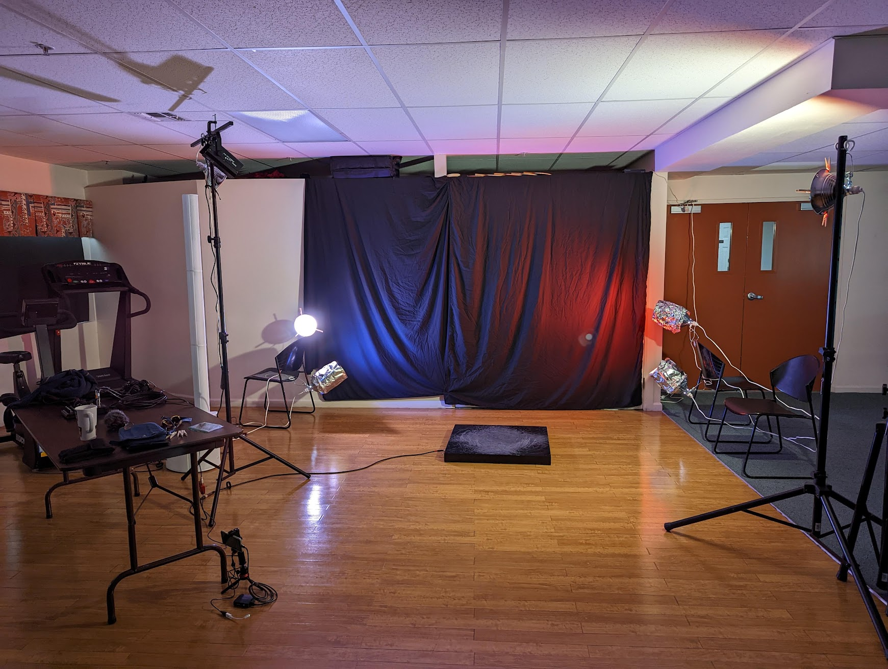

The kid has been gearing up to record an audition video for a dance company,
and I've been studying up on how to set up lights, so it looks cool.

I think I did pretty well,
for about $140 worth of parts.
It's primarily clamp lights,
and some el cheapo colored acrylic from Amazon
that I cut with $SPOUSE's CNC cutting machine.
Also some aluminum foil.

I know now that this is just standard 3-point lighting,
that somebody smarter than me figured out.
Looks pretty good though!
That back light provides a sort of halo, to give depth on the screen.
And the colors against the black fabric (bedsheets) provide texture.

That's about all I know about lighting so far.

For sound, we played music through a mixer,
and hard panned both channels to the left side.
The dance pad has a mic inside it,
that we hard-panned to the right.
Hopefully this makes it so the postprocessing can mix feet in with stereo music.

---

I was up until 01:00 porting woozle's stuff over to a more unified login.
You still need three different passwords for various things,
but at least now it feels a little more like a single offering.

Today I moved my web site (and this blog) off of GitHub,
which provided web hosting for free.
Now it's on my cloud VM,
which is also free (because it's so dinky small),
but should be easy enough to move elsewhere if I need to.

And with that, I think most of my work is back on stuff I own.

I tell you what, though,
WebDAV is a lot nicer than I gave it credit for.
I've got my NAS on the public Internet now,
password protected,
and being able to get to my files from anywhere is pretty handy.
