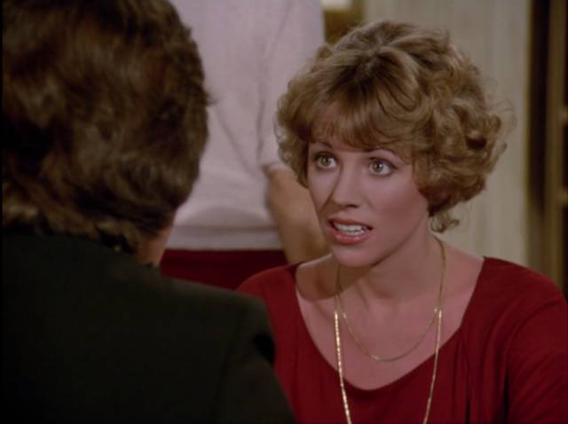

My sister-in-law gave me a bunch of episodes of The Love Boat for some reason, so I'm watching them.

# Season 02, Episodes 01-02

The crew takes a trip to a deserted island only to discover it's inhabited by crazy Gomez Addams, who takes them hostage at gunpoint and forces them to plan a surprise birthday party. They make plans to escape, but are thwarted by the arrival of a hurricane. An old lady inexplicably grows affection for the captor, and by the end of the double-episode plans the surprise party, then decides to stay behind and keep him company as she lives out the last few months of her terminal illness.

Meanwhile, Isaac the bartender manages to pull the wool over the eyes of a sexy model by having the crew talk him up like he's some rich successful dude. When she finds out he's the ship's bartender, she's angry, but, because she's a woman and therefore flighty, comes around to forgiving him after he takes responsibility for the safety of the passengers when the idiot acting captain doesn't. A love connection happens.

Finally, a woman who is a total jackass to her husband, during the hurricane on the island, confesses to him that the romance is gone, and she wants a real man. Her husband lowers his voice and makes up some stories about sleeping with a whole lot of women before he met her, and this somehow rekindles the romantic spark in their marriage.

# Season 02, Episode 03

## Julie's Dilemma

Julie, the cruise director, is expecting her parents on board. Turns out her father is Mister Roper. He and the Mrs let Julie know they're getting a divorce. Julie is pissed, but starts trying to hook them up with sexy singles on board. They don't like it and decide to get back together. Julie gets a compliment from her boss for hooking up two more people.

## Who's Who?

A TV censor winds up falling for a prude who passes out pamphlets about moral vices. They have a lot of stupid interactions where they try not to kiss, then they finally kiss and it's really traumatic for both of them. Then they discover they're roommates, and decide to get married. A whole lot of bedroom tomfoolery ensues, proving that even prudes like TV censors can find love, however unlikely.

## Rocky

A girl who wears baseball caps and sports jerseys befriends Danny Zuko's sister's son. She tries dressing up all girly for the boy, but he hates it. She decides to go back to presenting the way she's comfortable. Then they find out she's moving to his school district, and he asks her to a dance.

# Season 02, Episode 04

## The Man Who Loved Women

A dude dates three women at the same time and they find out, but decide he's a pretty okay dude.

## Oh, My Aching Brother

Some guy fakes a back injury but gives up the charade after a flaky woman with a torpedo bra shows interest in him.

## A Different Girl

A couple find out they both slept with someone else, but decide maybe that's okay.

The lady who played the wife put in a pretty stellar performance that the postproduction team
seems to have chosen to ignore.

When she tells her husband how excited she is that she's been offered a big promotion,
he tells her he'd prefer she stays at home.

> ... you'd be good at anything you tried. But the thing you're best at is being my wife.
> Boy do I brag about you to my buddies overseas.
> I told those guys you can cook up a Sunday dinner that would put the Ritz to shame,
> and that you've got a shape that makes Charlie's Angels look like Hogan's Heroes.
>
> 

Of course, her incredulity that he'd respond this way
is brushed away immediately by editing.

# Season 02, Episode 05

## Julie's Aunt

The captain's uncle shows up and starts aggressively sexually harassing Julie (the cruise director). I'm talking like physical assault: grabbing her, throwing her to the ground, while the laugh track rolls on. She repeatedly seeks the help of her (men) co-workers, who are sympathetic but reluctant to intervene. Eventually she convinces Gopher to dress as her police inspector aunt to thwart his advances, which he does. Then the uncle starts harassing Gopher, but quickly repents when he realizes Gopher is a dude.

## Where Is It Written?

An author and his editor board the ship, with the editor's wife. The editor won't stop working, so the wife hangs out with the author instead. He keeps putting the moves on her, which she rejects. Eventually the editor notices, and they have a ridiculous fistfight which results in them all getting dumped into the pool. This convinces her that she actually still likes her wet blanket of a husband, and he agrees to stop working while on vacation, just as the vacation ends.

## The Big Deal

Some woman shows up with her dad and her dad's business partner. The dad's business partner lecherously eyes her and decides somehow that she's part of the business deal. She goes along with it because she wants her dad to succeed, but then she meets Ponch from C.H.I.P.S. and realizes she still holds a candle for him from high school. Lecherous guy gets all jealous and I don't know what happens next because I stopped caring.

# Season 02, Episode 06

## The Witness

Mike Brady was a witness to some heinous crime. He falls in love with some lady who also knows about the crime, and the crime weighs on him so much that their relationship is tortured and boring. Oh, snap the murder victim was her brother. What are the odds?

## Mike and Ike

Isaac the Bartender recognizes a family (they're also black, of course). Turns out the three adults were in a doo-wop band together. The dad nows owns a bunch of car dealerships and can't stay off the phone long enough to hang out with his son. Isaac tries to convince the dad to spend time with his son. I actually like how Isaac was portrayed here, he starts to show some real depth of character.

## The Kissing Bandit

Miracle Max dresses up every night with a mask, cape, and fedora, and runs around the ship grabbing women and kissing them. Meanwhile there's a woman actually interested in him during the day, and he's skipping out on her to do his kissing rounds at night. This one actually made me laugh, a Love Boat first. Right until the crew decides to use Julie as "bait" to catch the kissing bandit. In hindsight, maybe sexual assault isn't all that funny.

The actress who played Julie wound up addicted to cocaine, and was one of the very first Hollywood people to openly admit they had a drug problem. They dropped her from the show, but she did make a full recovery right around the time The Love Boat ended its run.

# Season 02, Episode 07

## Ship of Ghouls (Story 1)

Some white lady is all self-conscious because she has a scar on her face.

## Ship of Ghouls (Story 2)

The owner of The House on Haunted Hill is an illusionist whose wife is upset that he can't leave his work behind.

## Ship of Ghouls (Story 3)

Some kid is worried that his dad might leave for a whole year again, which makes him a pathological liar.

Two stories intersect when the white lady is so upset about her scar that she decides to jump overboard.
The lying kid can't convince anybody he found her on the rail,
so he talks her down himself with a lie about how his mom committed suicide.

# Season 02, Episode 08

Julie's sporting a new hair style in this episode.

## Anoushka

Hot Lips Houlihan boards the ship as a godless commie cruise director,
in some sort of east/west cruise staff exchange program.
She talks to Julie about the glass ceiling,
making this perhaps the first episode that passes the Bechdel test.
The doctor gets bored and wanders off.

Comrade Hot Lips asks Julie to do her hair and makeup,
then shows up to dinner looking sexy.
Suddenly the doctor wants to talk to her,
proving, I guess, that the doctor is a pig.

Comrade Hot Lips decides she's way more interested in the doctor
than her career, and she spends the rest of the episode pursuing him.
He proposes marriage at the end of the 3-day cruise,
but she has to go back to Russia.

## Accidental Cruise

Soupy Sales shows up drunk with his secretary.
Turns out they don't have tickets, they thought they were going to his apartment.
She confesses her love to him,
but he just wants her to take dictation.

I'm deeming this "Love Boat Plot #1":
man can't stay away from work.

Toward the end, she forcibly kisses him,
prompting the crew to use the word "assault" for the first time
this season.

## The Song is Ended

Susan/Sharon's older sister and her husband
take their first vacation without kids.
They run into the host of Family Feud,
and realize their marriage has failed.

But then the game show host sings a song,
and they decide to stick together.

The actors almost got a tear out of me.
Could just be Love Boat Fatigue though.

## A Time for Everything

Within 30 seconds it becomes clear the captain is a father to an orphaned love child.
The rest of the story proceeds to slowly reveals additional clues,
in case the viewer is an idiot.
The captain spends a lot of time staring off-screen as the camera zooms in.
Sometimes this triggers a flashback.

Then the little girl leaves,
and the captain reads through a bunch of love letters he's kept from her mom.

Between this attempt at a tear-jerking ending,
and Hot Lips crying about having to go back to Russia,
this probably qualifies as "A Very Special Love Boat"

