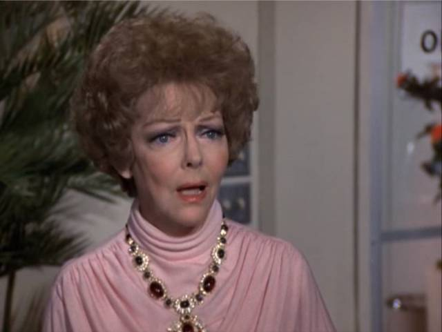
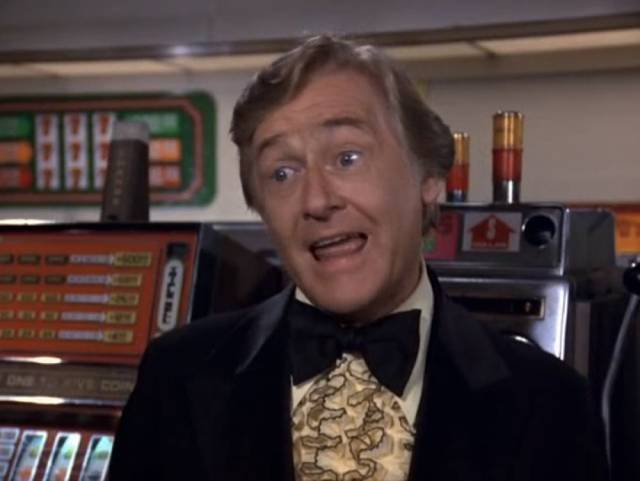

I'm still watching The Love Boat.
I find it interesting that this is easier for me to stick with than Doctor Who.

# Season 02, Episode 10

It's thanksgiving on board the Pacific Princess!
And presumably off-board too.
At least, in the United States.

## Tony's Family

The ship engineer called in sick,
so they ask Tony to stay on another shift,
but he's mad because he was going to spend the holiday with his family.
So they're like, well, just bring them on board.
Womp womp, turns out he has six people in his family.
And Tony's mom brought a chicken.
Batten down the hatches, here come the immigrant jokes!

Actually, aside from the chicken thing,
this wasn't as bad as I expected.
Maybe I'm getting normalized to 1978 suburban America,
but I felt like most of the gags fell into two categories:

1. The chicken
2. Struggling to keep six people hidden from the captain

Anyway, they get discovered,
and the captain says they have to pay their fares,
so the crew offers to pool their money together to pay $1500 for everyone.
But then the young boy gives a dollar to a gambler from another story,
and God descends from the machinery.
The gambler returns with about $75 in coins from the slot machine,
and gives it to the family,
who uses it to pay off their $1500 debt in entirety.

## The Minister and the Stripper

A lady gets upset that her minister,
the captain from Airplane!,
falls for a stripper on the cruise,
and threatens to have him kicked out by the trustees or the board or something.
That means they're Presbyterian, I think?
I never could remember the intricacies of all the protestant governance structures.
Her husband threatens to leave her,
and she sees the errors of her ways,
deciding to use her influence in the governance body to defend the minister's decision.
Then the husband gambles a broke kid's last dollar,
turning it into about $75.

Costuming must have had fun with these two:

This one struck me as actually still relevant today.
And the captain from Airplane! did a believable job as a minister.
I heard they cast well-known actors to "play it straight" in the Airplane! movies,
and boy howdy, this guy was a good casting decision.

## Her Own Two Feet

A newly-blind lady doesn't want to admit she's blind.
The ship's doctor convinces her husband that his doting and excuses
are making it difficult for her to face reality.

The husband abandons her in their room with a cane,
telling her he'll be in the lounge and he hopes she comes to meet him.
She steels her resolve and gets herself down the hall on her own.

I'll admit it: this one made me cry.

An episode of The Love Boat made me cry.
What the heck is wrong with me?

---

This show had a habit of hiring Hollywood stars from the 30s and 40s,
who weren't getting a lot of work due to their age.
They got some pretty impressive performances this way.
The "blind" lady was played by June Allyson:
a headliner, judging by posters from the films she starred in.
Her husband was played by Van Johnson, her frequent co-star.
(A previous release of this confused Van Johnson with Alan Young.)
Here's Van expressing... grief? asphyxiation? 
I've decided to call it "the eyeroll of despair".



I wonder how many takes they did of this?
