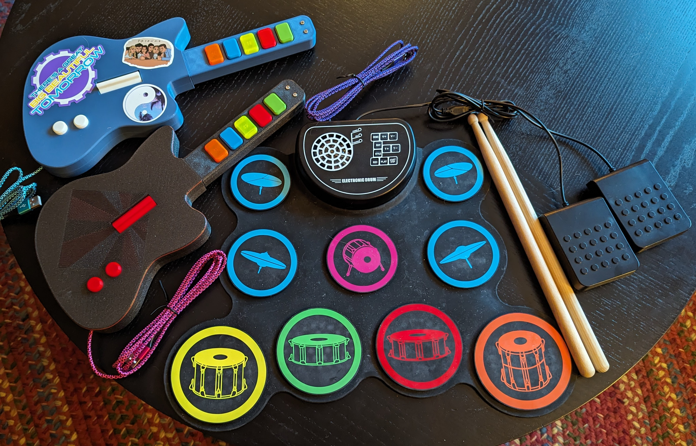

There are currently at least four efforts to get a working Rock Band drum kit:

## Mad Catz (mature)

Based on the vendor ID sent by the USB devices,
I think Mad Catz is the company that made most of the
officially licensed Rock Band instruments.
They're still selling something that takes MIDI input,
and outputs signals to look like a Rock Band 2 drum kit.

The converter plus a decent entry-level kit will cost about $500,
and probably provides a very nice feel.
You can also use the drums by themselves or as a MIDI controller.

## Mockband Drums (stable)

Using a $33 drum toy from Amazon ($25 on sale),
you can build a tabletop drum kit.
I've been playing on it for the last month
and the experience is comparable to the Rock Band 1 kit I had 10 years ago.
It's okay, but not fantastic.

This requires some soldering,
but all the development is done.
If you're crafty,
you can probably have this working in an afternoon.

https://git.woozle.org/neale/mockband

## Polybar Drum Kit (in development)

Some of the polybar people are working on a from-scratch 3d printed drum kit.
So far it seems they're trying to use piezos to read drum hits,
which could mean it will send some kind of velocity information.
Although probably not super accurate,
and I haven't yet seen a game that uses it,
this would be closer to the official Rock Band drum kit.
When it's closer to finished,
it will probably use the santroller firmware
(see below).

I'm trying to help these developers
with what I've learned from Mockband.
When it's finished,
you can expect a nice detailed instruction manual
and lots of community support,
just like the polybar.
There may even be kits you can buy from etsy.

As far as I know,
all development on this project is happening on Discord,
so there's no URL to add here.

## Santroller (stable?)

Sanjay9000,
the person who was made a very nice packaged version of a Rock Band guitar controller firmware,
has released a new firmware that claims to support drums as well.
This is made to replace the firmware in an official Rock Band drum kit,
but will probably be what the Polybar effort uses,
because so much effort has been put into making the firmware easy to set up.

https://santroller.tangentmc.net/
