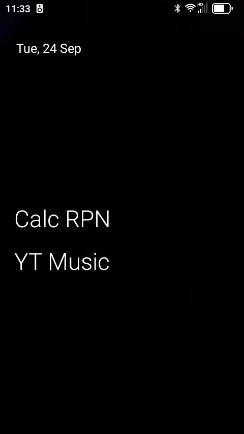

I've been using a "Jelly Star" Android phone for the last week.
It's about the size of 16 credit cards bundled together.

It provides something like a featurephone,
with a 2-day battery life,
small size,
and never getting a security patch.
Because it's Android, I can install any Android app.
But because it's a security nightmare, I don't.

I've spent quite a while configuring it:
around 10 hours so far.
This is mostly a note to myself,
in case I ever have to factory reset this phone.
Maybe it will help other people, too.

Install No-Icons Launcher
=========================

I like OLauncher.

My two home screen apps are a calculator (I use RealCalc,
because I like Reverse Polish Notation), and
YouTube Music (for podcasts, mostly).

I have the launcher configured to swipe right for the phone app,
swipe left for the messages app.
I had to reassign the phone app to the swipe right action
to prevent it from bringing up the dialer each time.

I also had to briefly switch back to the factory launcher
to get the right bottom face button (recent apps) to work.
I don't understand why this worked to fix it, but it did.

Setting the font to the largest size was also helpful.

Remove/Disable Apps
===================

This phone will never get a security patch,
so I have to be very careful about what information is stored on it.
"Information" here includes data,
but also authentication tokens.

This means no banking apps, car apps, browsers, podcast apps (except YouTube Music,
which I verified re-encodes podcast icons), or cloud storage clients.

My first step was to remove or disable as many apps as I could tolerate.
This included:

* Google Drive
* Google Photos
* Google TV
* Google Assistant
* Chrome
* Gmail
* Keep Notes
* YouTube

Install Better Camera
=====================

The built-in camera is actually pretty good:
better than OpenCamera and a few others I tried.
But GCam is still the best.

I used [MGC 8.9.097 A11 V25](https://www.celsoazevedo.com/files/android/google-camera/dev-bsg/f/dl227/)
and loaded the [Jelly Star config](https://www.celsoazevedo.com/files/android/google-camera/f/configs-bsg-05/).
I've mirrored these in `media/software/GCam` on my NAS,
if those links ever break.

I made a few changes to the config:
[my config](js2.xml) might be a better starting point
if I have to reinstall the phone.

I installed the "Gallery" app (by Google)
to view photos.
Google Photos doesn't appear to provide anything I want.

I can't get "top shot" to work:
it's the feature that records a little video when you take a photo.

RCS with Messages
=================

RCS wouldn't enable until I had updated the Messages app to the latest version,
and then cleared data for the app.

Weird System Things
===================

The OS has some strange additions in the settings.

Apply Advanced Settings
-----------------------

There are three things under here:

Network Manager
: A handly little thing to disable Internet access to certain apps.
I disabled it for GCam

App Blocker
: This is a power saving feature that works alongside (or maybe against)
the power saving already in the OS. I turned it off.

Freezer
: I think this is a way to hide apps from yourself.
Olauncher has it built in, so I haven't used it.

LED lights
----------

You can make the lights on the back of the phone flash.
I'm probably going to turn it off,
it's starting to annoy me.

Intelligent Assistance
----------------------

Some of these are well-explained on screen.
Some aren't:

Physical key switch
: "Lefty" mode, switches the function of the left and right face buttons
below the LCD, by making them "recent apps", "home", and "back".

Memory Extension
: I think this just creates a swap file. I wouldn't do it,
once you wear out the flash memory, you have to buy a new phone.

Call recorder
: I guess this is nice? I turned it off.

LED notification
: This is the LED on the face of the phone.
Super useful! I have mine blink on missed notifications.
I wish more phones did this, but I guess it would mean
people aren't turning their phones on all the time,
which manufacturers probably don't want to happen.

Shortcut Settings
----------------

PTT key
: I guess there are some apps that work like a walkie-talkie.
You can turn this on to have the red side button be "push to talk"
for these apps.

Programmable key
: I left it at "None". I don't know what the other options do,
other than disable the shortcuts.

Shortcut settings
: You can have the red button do certain things.
Right now I only have it turning the flashlight on and off.

Other System Settings
---------------------

I disabled gesture navigation.
The screen is so small,
the gestures were conflicting with other stuff like swipe text entry.
Since the phone has the three face buttons anyhow,
this works out fine.

Install Some Other Apps
======================

Like it or not,
I need a few other apps:

* Car charging networks (PlugShare, EVGo, ChargePoint, and so on)
* PhotoSync, to back up photos. It *only* has access to photos on our NAS.
* PlayBook will play audiobooks. I like it.
* Plexamp for music.
* Travel apps: TripIt, Uber, Amtrak, Catima (stores barcodes)

Accelerometer
=======

The "Toolbox" app that comes built in is actually pretty nice.
It has a Pedometer that you can't seem to disable but are free to ignore.
It also has a "bubble level" that lets you see if the accelerometer is calibrated.
Mine wasn't.

To calibrate the accelerometer,
dial `*#*#3377#*#*` on the phone,
then select "GRAVITY CALIBRATIO N".
Set the phone on a flat surface and press "calibrate".
There's also a GPS test in here which shows speed,
and a "DISTANCE CALIBRATIO N" that exercises the proximity sensor.
Stay away from "MTKLOG", it must be force stopped to make it go away.
I don't know what "SMARTPA CALIB" does:
the Internet makes it sound like possibly something to do with the loudspeaker?
"SINGLE TEST" lets you exercise all the sensors and output devices,
including turning on both colors of flashlight LED (the amber one doesn't appear to be used by anything else)
I haven't played with "AGING TEST".

It might be worth calibrating the gyroscope in "SINGLE TEST".
Place the phone on a flat surface to do so.

Browser
=======

Two apps (TripIt and Amtrak) need a browser installed in order to log in.
I enabled Chrome temporarily to set these up,
then disabled it again.
