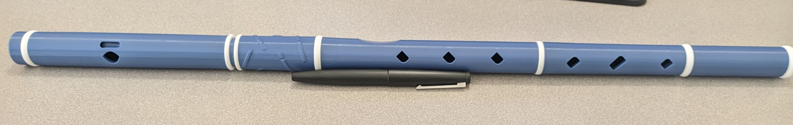

I 3D printed a flute!

This is an "Irish" flute, which apparently means it's based on a pre-Boehm flute from
around the 1600s. 
It was designed by some Russians named Marat Axianoff and Marina Tiik.
It's open-hole, no keys anywhere, and it was a very easy print.

I probably used about $5 worth of PLA filament making it.
For comparison, a new Doug Tipple flute, made of PVC pipe,
looks to be selling for $135 right now.
And a used wood flute is about $215 on eBay.

I'm not a flute player (yet) so I can't really comment on the tone.
I can tell you, however, that I'm able to play all 8 scale notes,
I can easily get into the second octave,
and everything sounds in tune.

The flute is tunable by adjusting the head joint,
although my print appears to be on the flat side,
so I'm playing with the head joint inserted all the way.
If I find I need to get even more sharp,
I will probably re-print a head joint that I've trimmed down by a few millimeters,
which would not be an option with any other sort of flute.

I'm discovering I actually like playing the flute!
It's not a whole bunch more difficult than the tin whistle,
and the tone is less shrill,
so it's not as annoying to other people in the house.
Interestingly, the bagpipe is turning out to be less annoying than the tin whistle!

At some point I am probably going to recreate this design in OpenSCAD
so I can twiddle it, maybe add keys, or print a flute in a different key.
But for now I'm having a nice time learning to play some tunes.
