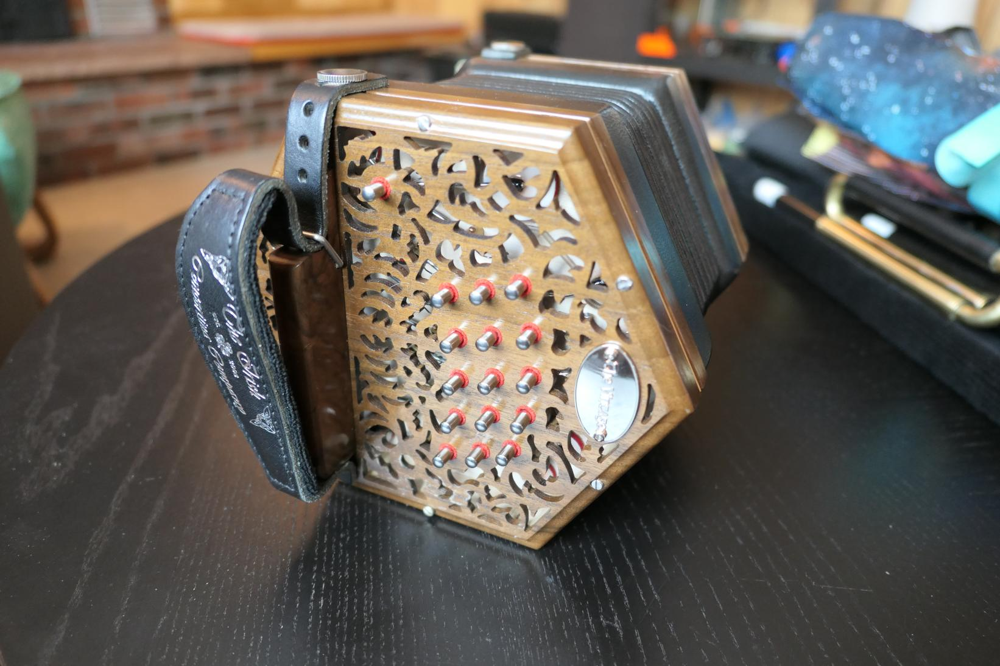

Here are the instruments we're playing these days:

This is everything in its housing. 
Starting with the red ribbon and moving clockwise,
there's the Uilleann pipes, some flutes/whistles,
a concertina,
some electronic bagpipe stuff,
the Uilleann pipe bellows,
and the Uillean pipe bag with the air hose on top.

# Concertina

Here's the Irish Concertina.
I think it's gorgeous.
It sounds lovely, too.
It was made by the Irish Concertina Company,
but she bought it very lightly used.
The former owner bought it,
couldn't wrap his head around how to play it,
and sold it back so he could buy a piano accordion.
This seems to be a pretty well-trod path with this infernal instrument.

My wife learned on a cheaper concertina,
and bought this when she felt like the cheap one was holding her back.
She was right: the improvement in her playing was immediate.

I can't really play this thing,
the button layout doesn't make any sense to me.
I would have been one of those concertina owners
who sells it back so I can buy a piano accordion.
But my wife is getting pretty adept at it!

# Uilleann Pipes

After years of playing the Fagerstrom Uilleann Technopipes,
I ordered a half set from David Daye.
He calls his pipes the "penny chanter" and "budget drones",
making extensive use of commercially-produced plumbing equipment,
which I find appealing.
They are about half the price of a comparable set,
and people seem to appreciate the tone of them.

My pipes came as a kit,
and took me about 3 months to get into a state I consider "finished".
This instrument takes a lot of maintenance,
and I agree with David that assembling the kit teaches you a lot of maintenance tasks
you'll need to keep them in good working order.

Everything packed up fits into a little backpack.
The big items are the bag and the bellows,
all the actual pipes roll up nicely into the little sleeve we sewed for it.

Inside the sleeve is all the pipes.
From left to right are the drone stocks,
the chanter,
the bass drone tuner,
the baritone drone tuner,
and the little tenor tuner.
There's a yellow chamois under the chanter:
this goes over my knee to help seal off the chanter's bell,
and keep air from leaking out when all the toneholes are closed.

My bagpipes: a half set.
This consists of a bellows to pump air into the bag,
the bag,
a set of drones attached into the bag,
and the chanter coming out the narrow part of the bag.

# Flutes, whistles, and an electronic pipe

The flute, the whistles, and the electronic bagpipe,
all fit into this roll-up sleeve.

Because the bagpipe's double reed is made of natural cane (bamboo),
I have to be careful about the humidity I expose it to.
If I ever want to take it someplace humid,
I'm going to have to leave the reed at home,
and make a new one for the high humidity environment.

## Electronic Pipe

I was afraid of having double reeds in such a dry place,
so before I bought real bagpipes, I got the Fagerstrom Uilleann Technopipes.
This runs on a single AA battery, and outputs to a 3.5mm stereo earphone jack.
There's a way to wire up a MIDI controller as well,
but I've never tried it.

The bag is nothing more than a switch.
You have to squish the bag to close the switch,
simulating the extra pressure required to make real pipes jump into the second octave.

The electronic bagpipes aren't as expressive as real pipes,
and they're also not as finnicky.
I was able to learn scales and a number of tunes with this setup,
and this lasted me for 3-4 years,
until I was sure I wanted real pipes.

I made a tiny bag for the technopipes,
for travel.
It's just a momentary switch with some foam around it to make it thick enough to trigger under my arm.

Since the electronic pipe is the only instrument I have that can play through earphones,
it's what I usually bring with me on travel.
I do a fair amount of travel for work,
so this is pretty handy.
Maybe one day I'll get confident enough on the whistle
to bring one on a trip and
drop by a local session while I'm away!

## Aerophones

Everything has essentially the same fingering as the bagpipe,
and everything is pretty inexpensive,
so I'm learning all of them at about the same pace.

The flute is the cheapest instrument I own,
costing maybe $7 in PLA filament.
I have no other flute to compare it to,
but it makes a nice enough tone 
that I wouldn't hesitate to play it in public.
You can make your own using
[the 3D files](https://www.printables.com/model/1097180-irish-flute)
and a little waxed thread for the joints.

I find the flute to be more challenging than the bagpipe,
which probably isn't what people would expect to hear.
Decades of playing the oboe has made it difficult for me to adapt to the flute embouchure,
and I find the fingering awkward and hard on my tendons,
especially in my left hand.

Below the flute are the tin whistles.
I didn't get serious about the tin whistle until after I printed the flute.
The whistle is very nearly the same fingering as the flute,
but doesn't have a difficult embouchure or cause tendon discomfort,
so I'm able to play it longer and faster than the flute.

The topmost whistle is a black Clarke original,
which my wife bought on a lark maybe 10 years ago.
I think it cost about twice as much as the flute.
We didn't play it much,
until I printed the flute.
The original has a breathy sound,
and requires about twice as much air volume as the other whistles.
That means you have to stop to breathe more frequently.

Below that is a green Clarke Sweetone,
probably about the same cost as the other Clarke.
It sounds lovely to me.
I can play about twice as long as the original with one breath.
In my opinion,
the essential nature of a tin whistle is that it's
inexpensive and easy to play.
The Sweetone checks both boxes:
if you're looking to get started on a whistle,
this is the one to start with.

At the bottom is a McNeela Wild Irish whistle.
It was given to me as a thoughtful gift, but
I think these cost about as much as four Clarke whistles.
It's a nice whistle with a very pure tone (not very breathy),
but I don't think it's four times better than the Sweetone.

# Not Pictured

Other stuff we have acquired over the decades:

* A mandolin that barely stays in tune, picked up from essentially a garage sale
* A guitar my wife gave me not long after we were married, tuned in DADGAD
* A guitar my father loaned to me, in standard tuning
* A little ukulele
