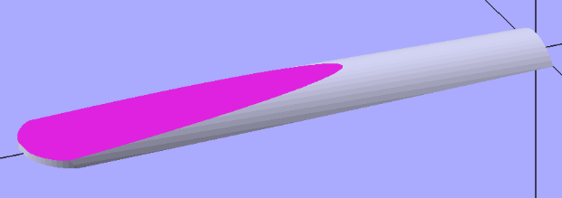

I've been corresponding with "Animatorgeek" about the 3D printable
Bulgarian bagpipes they designed.
The exciting part (for me) about their design is the 3D printed single reed.
This is exactly what I need for my Uilleann drones.
 
After a couple hours of work, I've got a working clone of their reed in OpenSCAD.
It looks like this:

It looks a lot like a clarinet or saxaphone reed, but smaller.
I've only modeled the Bulgarian chanter reed so far,
but now I have an algorithm that I can give different arguments to make a tiny one.
