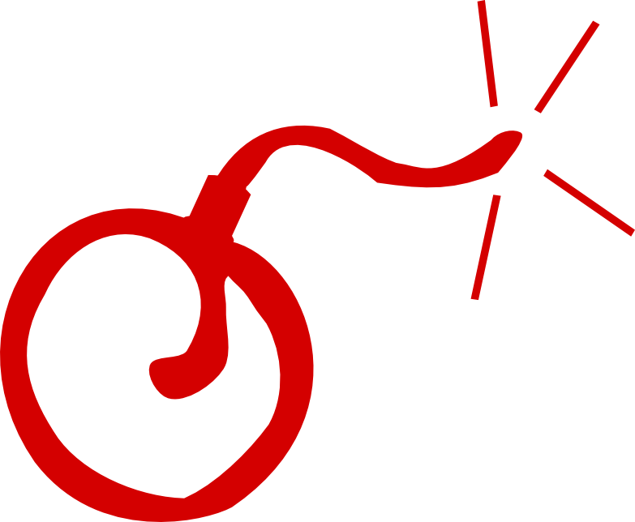
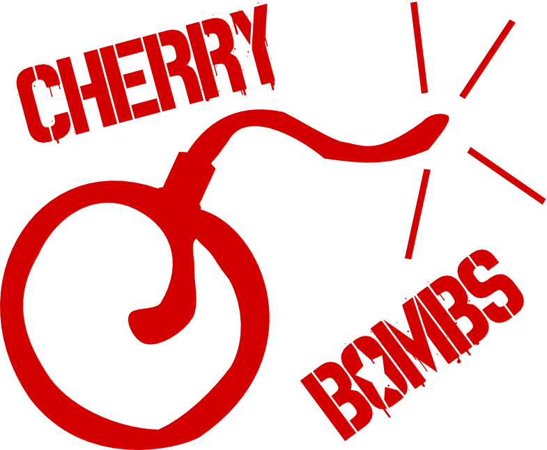
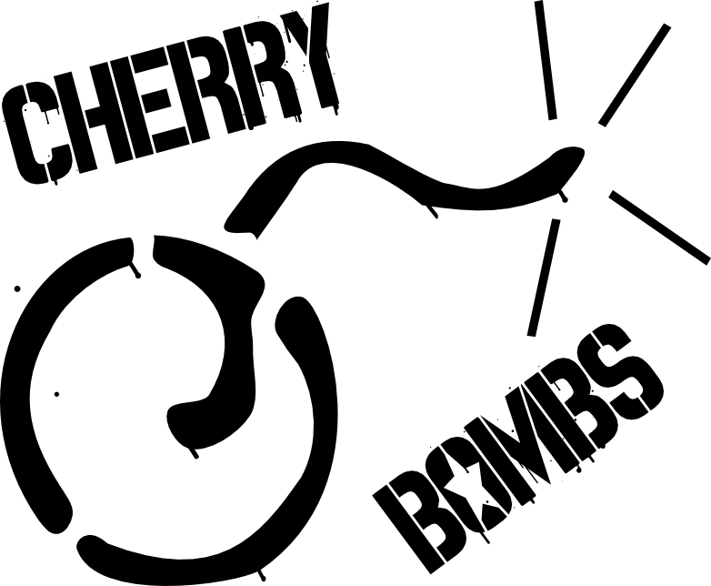

I'm pretty excited about the new youth league starting up,
but since I can't skate,
I have to find ways to contribute from behind the scenes.
So I worked on another logo.

This is for a junior (youth) league,
so it can't be too sexy or aggressive.
The font I used here is 
[Spray.ME](https://fontstruct.com/fontstructions/show/718516)
with an "O" modified to include a jammer star.

I wanted something kids could sketch easily and quickly,
on their faces or notebook covers or whatever.

It needed to work in a single color,
for cheaper T-shirt prints, temporary tatoos, stickers, and stuff.

Lastly, I wanted it to be easy to turn into a stencil,
for spray painting helmets,
cheeks, or whatever.

----

[Here is the source file](cherry-bombs.svg)
for everybody to play with.
This logo is all yours to do with as you please,
as long as you share alike
(see the bottom of the page for details).

 CherryBombs Logo by <a xmlns:cc="https://creativecommons.org/ns#" href="https://woozle.org/misc/cherries.html" property="cc:attributionName" rel="cc:attributionURL">Neale Pickett</a> is licensed under a <a rel="license" href="https://creativecommons.org/licenses/by-sa/3.0/deed.en_US">Creative Commons Attribution-ShareAlike 3.0 Unported License</a>.
