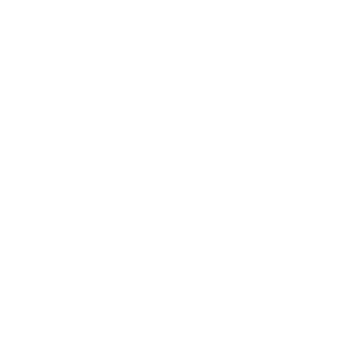
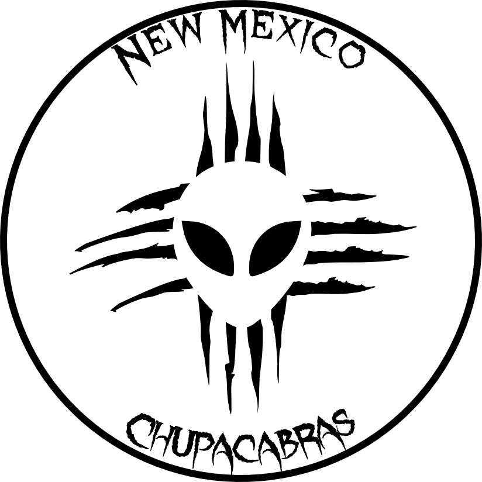
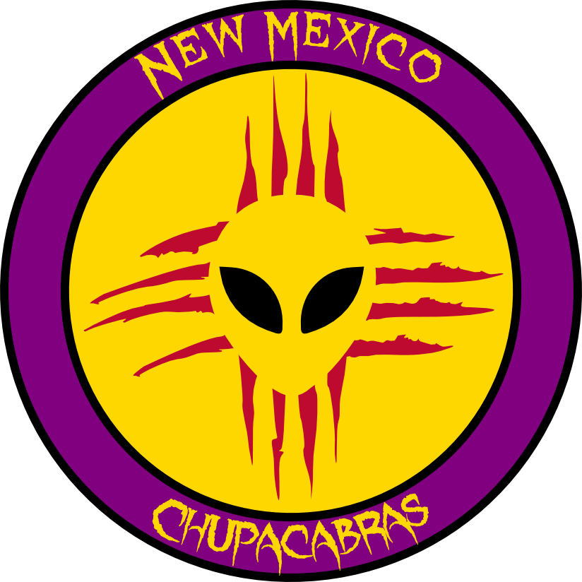
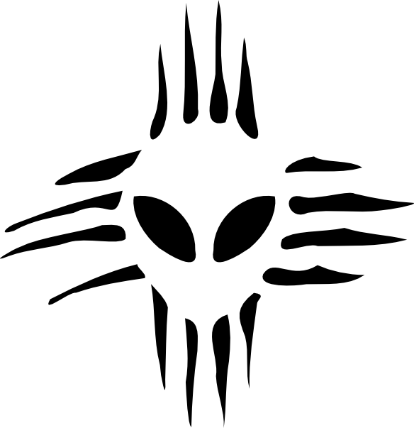
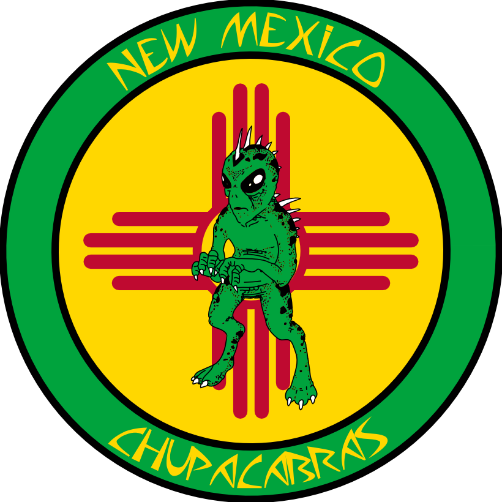
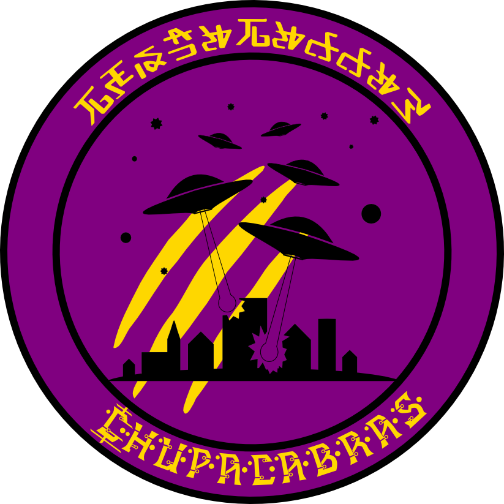
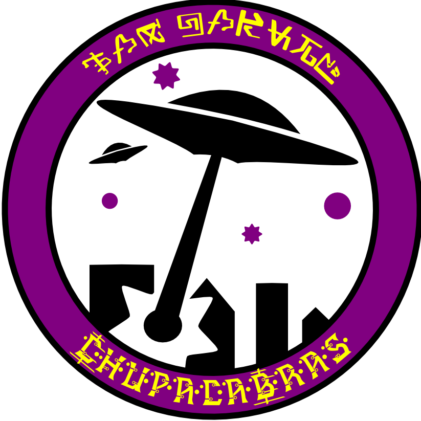
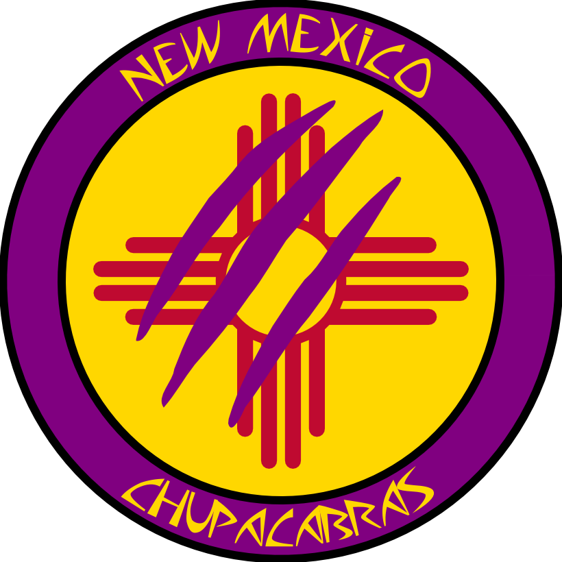

I would love it if someone could take these sketches
and turn them into something the team will use,
because I'd love to have a sticker of this on my laptop.

I tried to incorporate New Mexico's Zia symbol with the chupacabra:
a cryptid sometimes drawn as a "grey" alien with claws.
This logo feels like a real sports team to me.
It conveys fierceness and mystery, only uses 18 objects,
and looks great with only one ink color.
Because all the negative space is connected,
it's possible to make a stencil.

[Here is the source file](chupas.svg)
for everybody to play with.
This logo is all yours to do with as you please,
as long as you share alike
(see the bottom of the page for details).

----

Here's a black version.
Not quite exciting as the white one,
but still pretty cool,
and still easy to recognize

----

Here's a medallion form with the team name.
I'm not crazy about this font,
it's difficult to read at a distance,
although it does match the feel well.

----

A color medallion, for buttons,
print media,
web sites, etc.

This uses 4 colors: black, purple, yellow, and red.
You could change the colors to whatever your teams uses.

----

A smoothed-out version more suitable for die-cut vinyl stickers and tattoos.

----

Earlier designs
--------------

Here are some earlier designs I didn't like as much:

----

 Chupacabras Logo by <a xmlns:cc="https://creativecommons.org/ns#" href="https://woozle.org/misc/chupas.html" property="cc:attributionName" rel="cc:attributionURL">Neale Pickett</a> is licensed under a <a rel="license" href="https://creativecommons.org/licenses/by-sa/3.0/deed.en_US">Creative Commons Attribution-ShareAlike 3.0 Unported License</a>.
