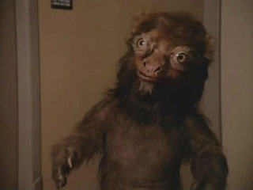

# s02e01: Why is Wesley Driving the Ship

"The Child"

Deanna experiences some kind of immaculate conception via shiny light, and the previous doctor got a promotion so she's gone, but she left her kid to drive the ship apparently. Starfleet Academy is not required to become a pilot. Someone should tell that to Tom Paris.

# s02e02: Welcome to Digital Art of the late 80s

"Where Silence Has Lease"

I really thought this was going to be a Q episode, but instead it's just an ugly giant face floating in space that controls everything. I don't remember anything other than that, fell asleep.

# s02e03: Writers got bored again, back to the Holodeck

"Elementary, Dear Data"

Data tries out solving mysteries like Sherlock, but nobody is impressed because he doesn't actually solve them the way humans are used to. I think Jordy gets upset with him? I'm usually Team Jordy so he probably had good reason to get annoyed. The new doctor shows up to play dress-up with Moriarty, who evolves somehow into a good guy. Okie dokie.

# s02e04: Why not just do an episode about Betazoids

"The Outrageous Okona"

Dude shows up dressed like a pirate and wants to have affairs with the ladies. He likes Deanna I think? Some plot about space-based Romeo and Juliet and everything ends up fine without any need for mutual suicide. And pirate dude goes back to being a pirate. Pretty sure they were hoping he reminded everyone of Han Solo.

# s02e05: The 1980s realizes that deaf people exist

"Loud as a Whisper"

The chief negotiator in some sector is deaf and relies on telepathy and his chorus to communicate, also he knows ASL by the end of the episode? Data sucks at ASL, and I don't even know ASL. This guy is gonna tough out negotiations when his chorus gets killed off through hope and perseverance. 

# s02e06: More people hating on Data

"The Schitzoid Man"

The new doctor doesn't have a corner on that market anymore - now there's this guy, who's sick and honestly I don't remember much other than he really wasn't satisfied with how android development has gone. Apparently he ends up transferring his mind into Data by the end, must not have minded androids too much.

# s02e07: Questionable medical decisions and Potatoes O'Brien enters

"Unnatural Selection"

The doctor is just hell-bent on starting an epidemic in this episode. Thankfully, she's gonna be a sample of one in exposing herself to whatever is causing fast aging. I fell asleep before I saw the end, but apparently O'Brien does something with the transporter and reverses aging. I wonder if we get to see that trick again.

# s02e08: Riker and the Klingons

"A Matter of Honor"

Riker gets sent to a Klingon ship to temp as first mate, but first he eats a bunch of disgusting things to prep for Klingon life.
Apparently Riker is really interested in the idea of his duty to kill the captain if needed. I don't remember much else.

# s02e09: Data gets his arm pulled off by Riker

"The Measure of a Man"

This episode is either meant to show how wiley Capt Picard is in legal arguments, or we're supposed to get weirded out by Data getting pulled apart during a legal proceeding. Also Data apparently had "intimate relations" with that short-haired blond chick who was head of security last season but met her fate with the best villain in Star Trek, Armus. I'm going to try to talk a lot about Armus because everyone's already forgotten about him. I guess Data is actually a real man after all, thanks blond chick. 

# s02e10: Jordy has had about enough of Wesley

"The Dauphin"

More terrible computer graphics, which we get to see as Wesley's new love interest is actually a maroon Sasquatch type thing. It took us three tries to get through this episode, but we saw it through! Wesley was back to driving this ship again at the beginning. I guess whoever sits in that chair is how they tell us which character is important. Jordy tells Wesley to get the hell out of his engineering area because he's a serious pain in everyone's rear ends.

# s02e11: Apparently the Romulans visted the Enterprise

"Contagion"

I think this one mostly featured an angry Romulan captain who didn't want to have to work with the Enterprise crew, but did it anyway. That is all I remember. 

# s02e12: Aliens read novels, too

"The Royale"

Riker finally figures out that the aliens are just trying to make their spaceship more comfortable and familiar to the away team by basing their made-up surroundings on a terrible Western novel. I think. I fell asleep real early twice watching this epidsode.

# s02e13: Picard doesn't care about time paradoxes

"Time Squared"

I gotta be honest. I was on a real run of falling asleep real early in the last few episodes, and that trend continued. However, I did notice that in this episode, Picard doesn't seem at all worried about time paradoxes when he has to deal with running into his future self. Isn't that a requirement for most sci-fi? Well, I'm glad it worked out for Picard because he survived this episode.

# s02e14: The Love Boat: Daddy Issues

"The Icarus Factor"

Riker's dad visits, and it turns out he and the new doctor have a thing for each other. Riker does not appreciate his dad at all and makes that very clear when they play some kind of fighting game with giant q-tips and flimsy helmets. Riker decides to stay on the Enterprise instead of heading up his own ship, what a shock. This was a very soapy episode.

# s02e15: Picard hates kids on the bridge. We get it.

"Pen Pals"

Remember when Picard got all pissy because Wesley, who has got to be the world's most well-behaved boy, stood in the lift and just looked out onto the bridge in the first episode of Next Generation? Well, I miss that kind of fit-throwing too. Thankfully, Data really delivers by bringing his alien underaged friend onboard, and Picard cannot deal. There's some more angst about the prime directive, and Picard takes a page out of Janeway's book and just turns a blind eye. Well done.

# s02e16: Borg, baby

"Q Who?"

The Borg finally show up in their lego Big Blocks spaceship and give the Enterprise crew a little bit of a wake up call. I really thought that the Borg Babies were a Voyager creation, but it turns out, they've been taping plastic sensors and probes onto sweet little babies' heads from the very beginning! And, who knew that Whoopi was the one to get to name the Borg? Well, thankfully we have Q to play demi-god or something and we can kick the Borg can down the road a little more. Also, Riker didn't push that Borg Baby incubator back into the wall like he should have. Poor borg baby.