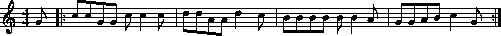

I had a little baby  
She liked to poop a lot  
And when it came out of her butt  
The temperature was hot

She liked to poop her diapers  
The smell was never strong  
And when she pooped them really good  
Her dad would sing a song

### chorus ###
Poopy Poopy Poopy  
Poopy all day long  
Poopy Poopy Poopy  
This is the Poopy song  
(repeat)

This little baby pooper  
She liked to bounce and dance  
And when you least expected it  
She’d up and poop her pants

She’d poopy in the morning  
She’d poopy in the night  
If she went long between her poops  
You knew things weren’t right

[chorus]

Her poop was many colors  
Like yellow, brown, and green  
Sometimes she made so much of it  
It made you want to scream

She always pooped for pleasure  
She never pooped for spite  
If poop were good and evil, then  
She’d poop for what was right

[chorus]
