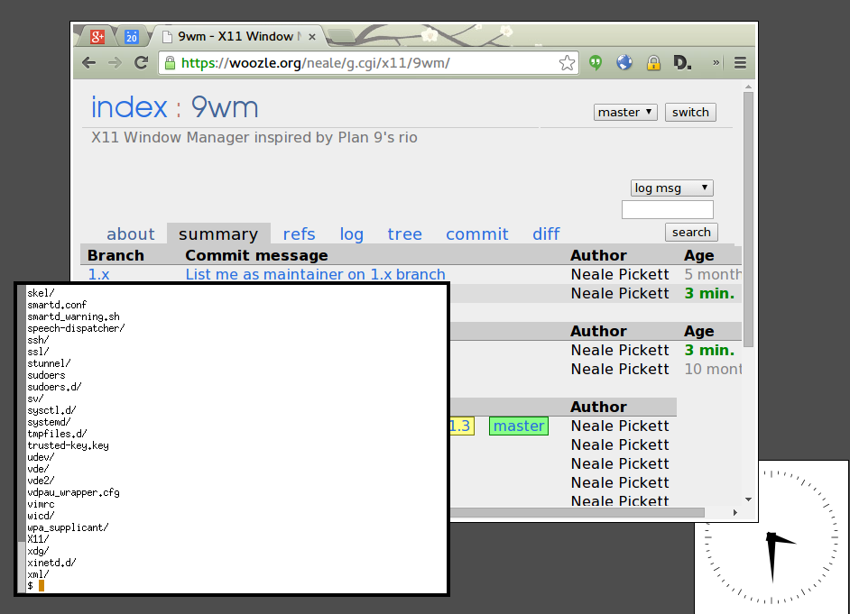

Title: 9wm
Author: Neale Pickett <neale@woozle.org>

9wm is an X11 window manager inspired by the Plan 9 window manager 8½.
It provides a very simple and clean user interface.
It makes heavy use of the mouse, and no use of the keyboard.
It is click-to-type.
It uses the X11 font system (which, unfortunately, means no Unicode support).

9wm does not provide virtual desktops, customization, key bindings,
or compositing.
It does not allocate any colors,
and only requires Xlib,
both of which will be great news if you are in 1993.

9wm is distributed under [an MIT License](https://github.com/nealey/9wm/blob/master/LICENSE.md),
at <https://github.com/nealey/9wm>.

How do I use it?
================

The focused window has a black border.
Mouse and keyboard events go to this window.
Left click a non-focused window (white border) to focus it.

Right-click anywhere other than the focused window,
including in any non-focused window,
to bring up a menu.
All further actions are done with the right mouse button.
The menu has options for:

* New: launch a new xterm
* Reshape: select a window, draw new rectangle for its size
* Move: drag a window around
* Delete: kill (close) a window
* Hide: hide (iconify) a window

Beneath the first 5 items are a list of all hidden windows.

Middle-click anywhere other than the focused window
to run "mm mouse2".
It's up to you to write an "mm" program and put it in your path somewhere,
if you want to use this for something.
I have mine run "google-chrome-stable --show-app-list".

More Information
================

More information can be found in the 
[README](https://github.com/nealey/9wm/blob/master/README.md).
