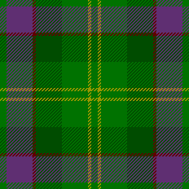

<canvas id="loom" width="800" height="800" style="width: 100%; background: #444;">
	Sorry, you need HTML5 and JavaScript for this.
	
</canvas>

<select id="preset"><option>Presets:</option></select>
<input id="sett" size="30">

